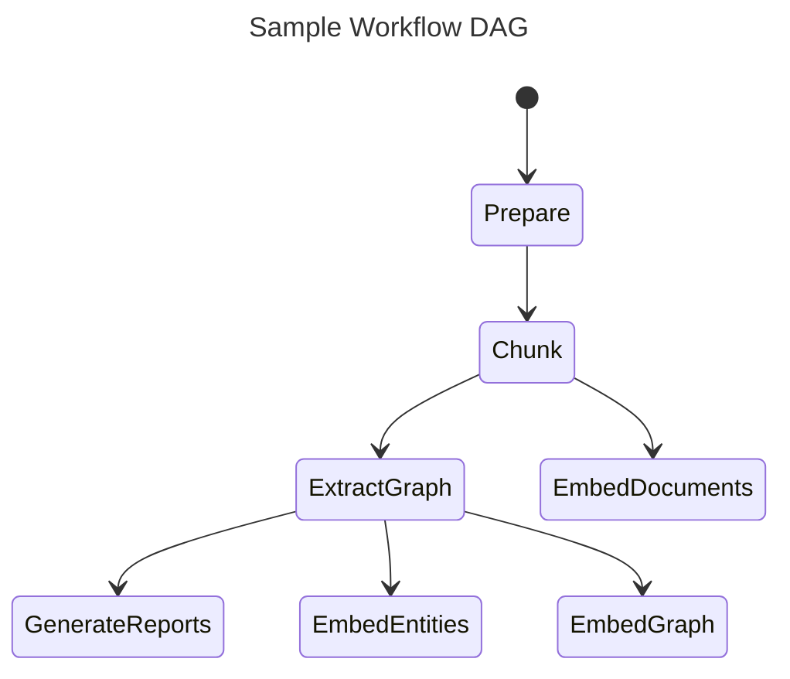
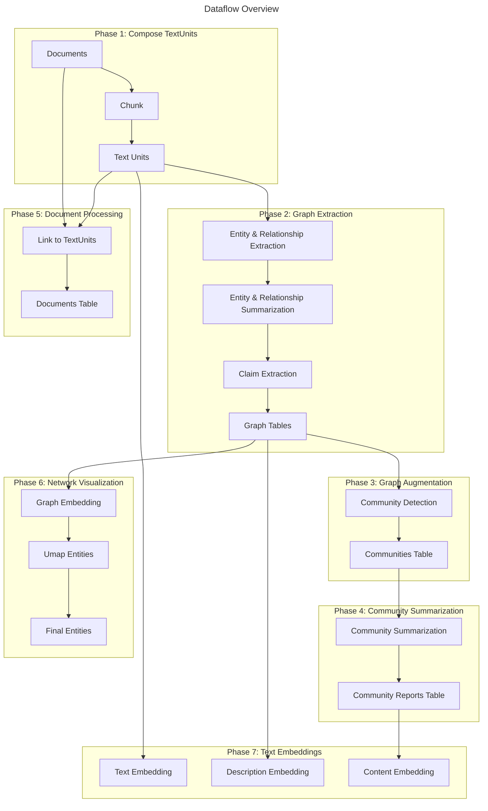

## Motivation

在当前大语言模型（LLM）驱动的问答系统中，检索增强生成（RAG）已成为主流方案。而 **GraphRAG** 作为一种结合图结构与文本语义的检索增强方法，具有结构化信息处理和多跳推理的潜力。本次调研主要围绕两个问题展开：

1. **GraphRAG 作为向量数据库能否输出结构化数据**：传统向量数据库更偏向于“黑箱式”的 Top-K 检索，而 GraphRAG 是否具备结构化输出能力（如实体、关系、社区）将决定其在知识组织和追溯中的适用范围。
2. **GraphRAG 的图关系处理流程是否适用于人物关系分析**：人物关系往往具有复杂的多跳连接、角色依赖和社群结构，GraphRAG 能否以结构化方式刻画并支持推理，是评估其在情报研判、社交网络分析等场景中的关键。

---

## GraphRAG survey

![[IMG-2025-04-17-11-42-23.png]]

GraphRAG 在 RAG 框架基础上引入图结构建模，整体机制包括两个核心阶段：

### 1. 索引阶段（Indexing）

- 文本被分块（chunking）成较小的单元（TextUnits）；
- 从文本中提取**实体与关系**，构建为图结构；
- 文本块与图结构分别进行嵌入，供后续查询使用；
- **图的节点/边与文本单元相链接**，实现图-文联合索引。

### 2. 查询阶段（Querying）

- 查询被结构化或嵌入后用于匹配；
- 图结构被用于执行多跳检索，挖掘关联路径；
- 匹配到的图子结构（子图）与文本块一并提供给生成模型；
- 最终生成包含结构信息的回答。

![[IMG-2025-04-17-16-09-23.png]]

### 图方法/策略对比表（Method/Strategy Comparison for Graph Tasks）

| Method / Strategy       | Input            | Output     | Description                     |
| ----------------------- | ---------------- | ---------- | ------------------------------- |
| **Entity Linking**      | Entity Mention   | Node       | 匹配查询中的实体（如人名、地名）与图中的节点          |
| **Relational Matching** | Relation Mention | Edge       | 匹配查询中的关系描述与图中的边                 |
| **Graph Traversal**     | Node / Edge      | Graph      | 从种子节点或边出发，扩展出相关子图               |
| **Graph Kernel**        | (Sub)Graph       | (Sub)Graph | 使用图核函数计算子图之间的相似度，进行匹配           |
| **Shallow Embedding**   | Any              | Any        | 使用浅层图嵌入（如Node2Vec）计算查询与候选的嵌入相似度 |
| **Deep Embedding**      | Any              | Any        | 使用深度图神经网络（如GNN）生成嵌入，计算查询与候选的相似度 |
| **Domain Expertise**    | Expertise        | Rule / Any | 基于领域知识定义规则，匹配图中的节点、边或子图         |

**与传统RAG比较优势**： 传统 RAG 通常基于文本块的相似度检索，忽略实体之间的结构信息。GraphRAG 的引入让检索具备“语义 + 图结构”双重约束，尤其在多跳推理、实体对齐、因果链追踪等任务中具有天然优势。

[微博数据集，社会影响力局部性：建模转发行为 | AMiner --- Social Influence Locality for Modeling Retweeting Behaviors | AMiner](https://www.aminer.cn/influencelocality)

## Microsoft GraphRAG

![[IMG-2025-04-20-18-46-02.png]]

**Graph communities**

给定上一步创建的图索引，可以使用各种社区检测算法将图划分为强连接节点的社区。在我们的管道中，我们以分层方式使用 Leiden 社区检测，递归地检测每个检测到的社区内的子社区，直到达到不再分区的叶社区。这种层次结构的每个级别提供了一个社区分区，它以相互排斥、集体详尽的方式覆盖图的节点，从而实现分而治之的全局摘要。

**Community Summaries**

下一步使用旨在扩展到非常大的数据集的方法为社区层次结构中的每个社区创建类似报告的摘要。这些摘要作为理解数据集全局结构和语义的一种方式独立有用，并且本身可用于在没有特定查询的情况下理解语料库。

### Microsoft GraphRAG 的索引与查询机制及其改进点

微软开源的 GraphRAG 版本在传统 GraphRAG 基础上进一步增强了结构提取和模块化能力，主要流程包括：

#### 索引阶段的关键模块：

1. **文本分块（Chunking）** → 文本单元（TextUnits）
2. **实体/关系抽取** → 图结构（三元组形式）
3. **声明（Claim）提取** → 高阶语义信息
4. **社区发现** → 聚合相关节点构建“群体”
5. **图与文的多重嵌入** → 支持图、文本、社区的多模态检索

#### 查询阶段：

- 可利用图嵌入与语义嵌入联合进行召回；
- 支持子图级别的检索结果组织；
- 可基于图路径信息构建答案因果链。

 **区别与优势**：

- Microsoft GraphRAG 明确输出结构化结果（表格、社区、UMAP 结构）；
- 支持**多阶段数据流**（如 Text → Graph → Community → Summary）；
- 更适合用于复杂知识工程、情报挖掘和多跳问答任务。

### Index Workflow



### 提取实体

|     | id                                   | human_readable_id | title           | type         | description                                     | text_unit_ids                                   | frequency | degree | x   | y   |
| --- | ------------------------------------ | ----------------- | --------------- | ------------ | ----------------------------------------------- | ----------------------------------------------- | --------- | ------ | --- | --- |
| 0   | 9cc787a9-2713-4b19-8fe8-9636e5ad9238 | 0                 | JD VANCE        | PERSON       | JD Vance, born James Donald Bowman, is a multi… | [6f66fba5a690feec19051442171293b4d0be793f5807e… | 2         | 21     | 0   | 0   |
| 1   | b5b92777-b01b-445d-a240-83b86ea5b865 | 1                 | DONALD TRUMP    | PERSON       | Donald Trump is a former President of the Unit… | [6f66fba5a690feec19051442171293b4d0be793f5807e… | 8         | 22     | 0   | 0   |
| 2   | 38863ac9-8440-4299-bf39-c96037bc58a8 | 2                 | MIKE PENCE      | PERSON       | Mike Pence is the former Vice President of the… | [6f66fba5a690feec19051442171293b4d0be793f5807e… | 1         | 2      | 0   | 0   |
| 3   | be99bf04-955c-4787-a549-f518c68f3b8d | 3                 | HILLBILLY ELEGY | EVENT        | "Hillbilly Elegy" is a bestselling memoir writ… | [6f66fba5a690feec19051442171293b4d0be793f5807e… | 6         | 7      | 0   | 0   |
| 4   | dc8cfd3a-f305-49d6-a829-4861fbc37946 | 4                 | MAGA MOVEMENT   | ORGANIZATION | The MAGA Movement, short for "Make America Gre… | [6f66fba5a690feec19051442171293b4d0be793f5807e… | 2         | 3      | 0   | 0   |

"Hillbilly Elegy" is a bestselling memoir writ…

### 提取关系

|     | id                                   | human_readable_id | source   | target           | description                                       | weight | combined_degree | text_unit_ids                                     |
| --- | ------------------------------------ | ----------------- | -------- | ---------------- | ------------------------------------------------- | ------ | --------------- | ------------------------------------------------- |
| 0   | 118ff68d-e9c6-4dfb-853c-f658e03ee46f | 0                 | JD VANCE | DONALD TRUMP     | JD Vance is the Vice President of the United S… | 17.0   | 43              | [6f66fba5a690feec19051442171293b4d0be793f5807e… |
| 1   | 3ba9bd73-a908-4426-b8f1-c95263a983ca | 1                 | JD VANCE | MAGA MOVEMENT    | JD Vance is a prominent advocate of the Maga m… | 9.0    | 24              | [6f66fba5a690feec19051442171293b4d0be793f5807e… |
| 2   | 700d6acb-09eb-4cc8-845b-9ba8d7ee78fe | 2                 | JD VANCE | HILLBILLY ELEGY  | JD Vance authored 'Hillbilly Elegy,' which ref… | 9.0    | 28              | [6f66fba5a690feec19051442171293b4d0be793f5807e… |
| 3   | a482a176-d94f-4f4c-bf05-38579b8d13a0 | 3                 | JD VANCE | MIDDLETOWN, OHIO | JD Vance grew up in Middletown, Ohio, which sh… | 8.0    | 24              | [6f66fba5a690feec19051442171293b4d0be793f5807e… |
| 4   | 0cfb2b8f-f8f9-4a2b-b5de-d828e8df525d | 4                 | JD VANCE | YALE LAW SCHOOL  | JD Vance attended Yale Law School, where he ea… | 15.0   | 24              | [6f66fba5a690feec19051442171293b4d0be793f5807e… |

### Dataflow Overview



## GraphRAG 输出结构化数据：人物关系图谱能力探索

GraphRAG 不仅支持从文档中提取答案，还能结合结构化索引数据实现复杂语义对象（如社交图谱、知识网络）的多模态表达。在本项目中，基于 GraphRAG 的 `search_engine.search()` 方法进行局部语义检索，可获得以下几类结构化数据：

### 1. 实体实体识别与聚合（Entities）

返回结果中的 `entities` 字段提供了与查询相关的命名实体列表，字段包括：

- `id`：实体编号
- `entity`：实体名称（如“J.D. VANCE”、“DONALD TRUMP”）
- `description`：实体说明
- `number of relationships`：图谱中该实体的连接数
- `in_context`：当前查询是否包含该实体

这类信息为构建结构化知识图谱提供了节点基础。

### 2. 社交关系提取（Relationships）

GraphRAG 会根据索引数据自动提取相关的双实体关系结构，字段包括：

- `source` / `target`：关系的起始与目标实体
- `description`：自然语言描述关系内容
- `weight`：关系重要性（可用于排序或上下文优先级评估）
- `in_context`：是否与当前查询显著相关

|     | id  | source       | target           | description                                       | weight | links | in_context |
| --- | --- | ------------ | ---------------- | ------------------------------------------------- | ------ | ----- | ---------- |
| 0   | 112 | VANCE        | U.S. SENATE      | Vance serves as a senator in the U.S. Senate, … | 8.0    | 1     | True       |
| 1   | 97  | VANCE        | HOWIE BEIGELMAN  | Vance has worked closely with Howie Beigelman … | 7.0    | 1     | True       |
| 2   | 114 | VANCE        | HALF ISLAND TV   | Half Island TV published commentary on Vance's… | 4.0    | 1     | True       |
| 3   | 35  | J.D. VANCE   | DONALD TRUMP     | J.D. Vance and Donald Trump are prominent figu… | 27.0   | 3     | True       |
| 4   | 50  | DONALD TRUMP | J.D. VANCE       | Donald Trump and J.D. Vance share a complex po… | 17.0   | 3     | True       |
| … | … | …          | …              | …                                               | …    | …   | …        |
| 68  | 41  | J.D. VANCE   | UKRAINE          | J.D. Vance has strongly opposed providing war … | 7.0    | 1     | True       |
| 69  | 42  | J.D. VANCE   | TAIWAN           | J.D. Vance's stance on Taiwan aligns with Dona… | 6.0    | 1     | True       |
| 70  | 60  | J.D. VANCE   | MIDDLETOWN       | J.D. Vance was born and raised in Middletown, … | 25.0   | 1     | True       |
| 71  | 74  | J.D. VANCE   | KENTUCKY         | J.D. Vance's grandparents migrated from Kentuc… | 7.0    | 1     | True       |
| 72  | 75  | J.D. VANCE   | OUR OHIO RENEWAL | J.D. Vance founded Our Ohio Renewal to address… | 6.0    | 1     | True       |

> 例如，对于“Vance的社交关系”查询，系统输出了其与 Donald Trump、Howie Beigelman、Yoram Hazony、Mitt Romney 等人物的多条明确互动关系，涉及政治联盟、宗教合作、思想传承等维度。

## 风险点

构建和索引图数据库是 GraphRAG 的基础，其中图数据库的质量直接影响 GraphRAG 的性能。

增量数据的问题，增量数据索引消耗 token 昂贵

实体提取的别名问题

## Prompt Tuning

```shell
graphrag init --root ./ragtest
```

```shell
graphrag index --root ./ragtest
```

```shell
graphrag query \
--root ./ragtest \
--method local \
--query "Vance的社交人物关系"
```

```shell
python -m graphrag prompt-tune \
--root ./ragtest \
--config ./ragtest/settings.yaml \
--language Chinese \
--domain "Social Relationship Analysis"
```